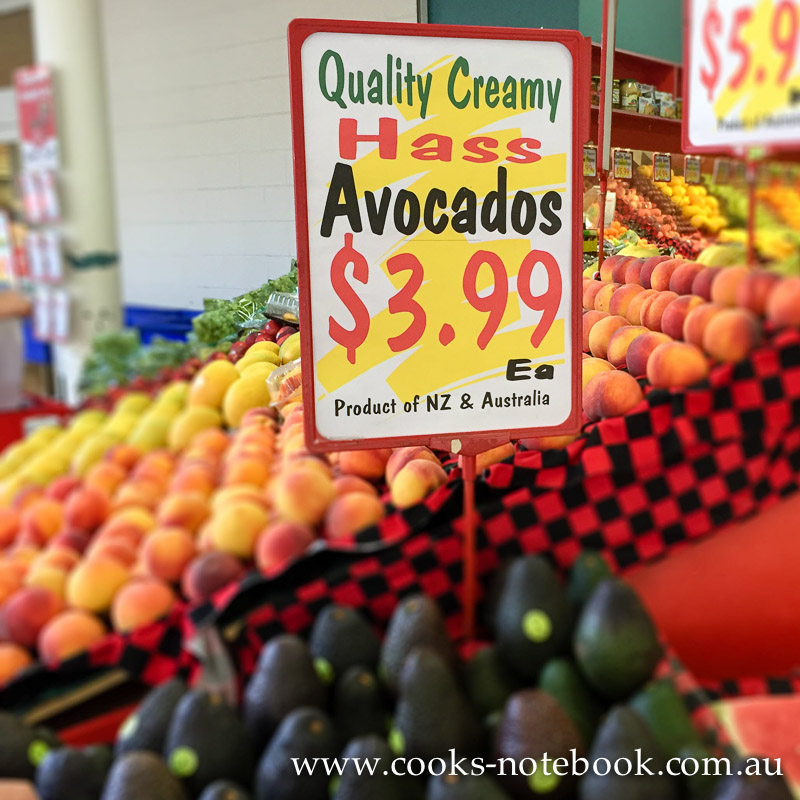
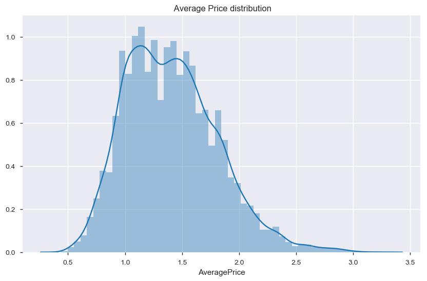
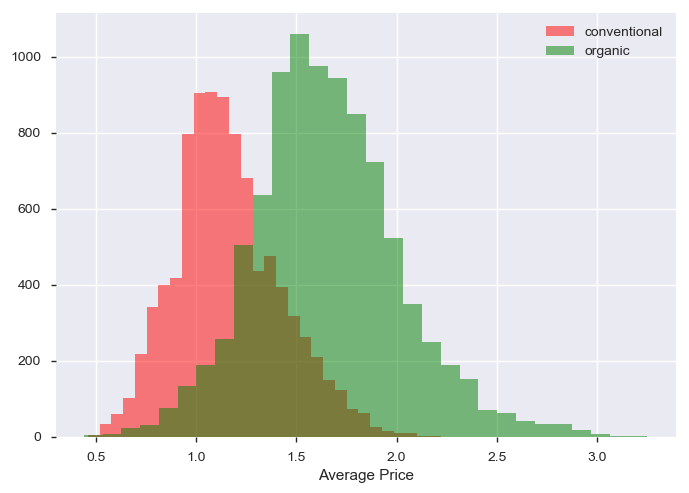
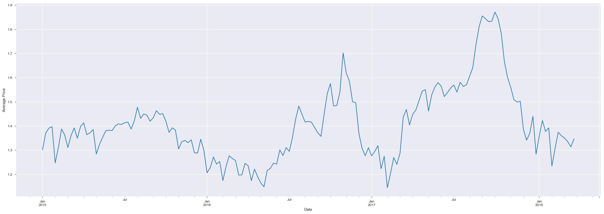
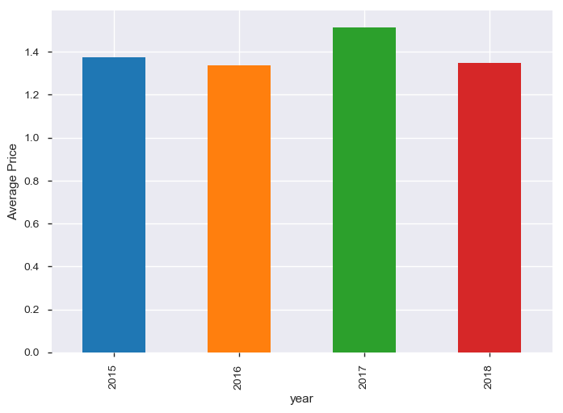

# Avocado Prices

It is a well known fact that Millenials LOVE Avocado Toast. It's also a well known fact that all Millenials live in their parents basements.

Clearly, they aren't buying home because they are buying too much Avocado Toast!

But maybe there's hope... if a Millenial could find a city with cheap avocados, they could live out the Millenial American Dream.

## Content

This data was downloaded from the Hass Avocado Board website in May of 2018 & compiled into a single CSV.

The table below represents weekly 2018 retail scan data for National retail volume (units) and price.

Retail scan data comes directly from retailers’ cash registers based on actual retail sales of Hass avocados. Starting in 2013, the table below reflects an expanded, multi-outlet retail data set. Multi-outlet reporting includes an aggregation of the following channels: grocery, mass, club, drug, dollar and military.

The Average Price (of avocados) in the table reflects a per unit (per avocado) cost, even when multiple units (avocados) are sold in bags. The Product Lookup codes (PLU’s) in the table are only for Hass avocados. Other varieties of avocados (e.g. greenskins) are not included in this table.

**Some relevant columns in the dataset:**

* Date - The date of the observation
* AveragePrice - the average price of a single avocado
* type - conventional or organic
* year - the year
* Region - the city or region of the observation
* Total Volume - Total number of avocados sold
* 4046 - Total number of avocados with PLU 4046 sold
* 4225 - Total number of avocados with PLU 4225 sold
* 4770 - Total number of avocados with PLU 4770 sold

## EDA
  

Average Prices are slightly skewed to their left. Highest number of avaocados are sold in the range of 1.1 and 1.6

 
Organic Avocados are sold at higher prices than conventional avocados.

 
The avg prices of avocados are more in the second half of each of the years when compared to first half of the year. The increase in summer price could be due to weak harvest in the year or insatiable demand for avocados.

 
Also year 2017 recorded highest average price of avocados

There are some more visualizations , which you can view in my jupyter notebook.

## Models and Evaluations

We have done some feature engineering, transformations to the data. As the target is to predict the average prices which is a continuous variable so we use regression techniques, decision trees, ensemble method like Random forest.

The accuarcy of the models was better when all the features were considered. Error metrics such MAE, MSE , RMSE are used to measure the accuracy of the models.

__Random Forest__ is giving the least error in prediction as compared to other models with __RMSE__ value as 0.14 hence we choose the algorithm for prediction of avocado prices.

