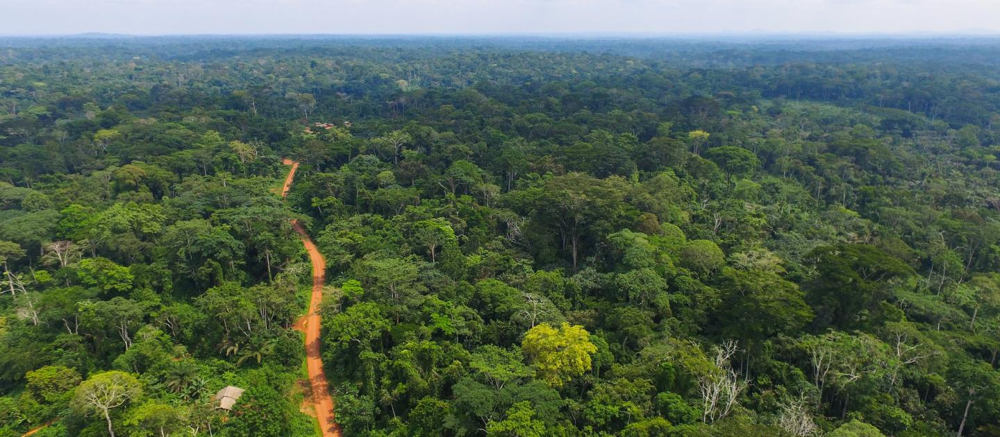
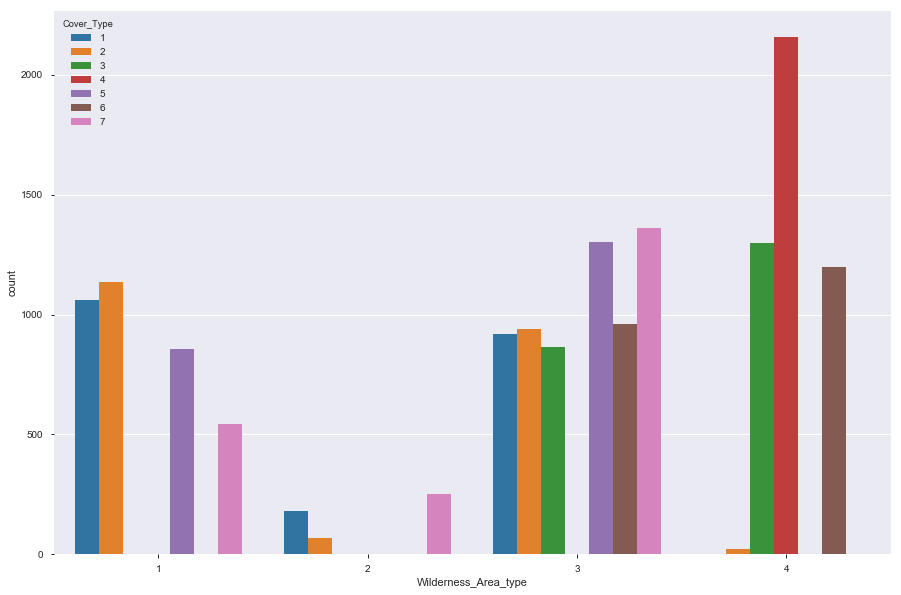

# Forest Cover Analaysis

The study area includes four wilderness areas located in the Roosevelt National Forest of northern Colorado. Each observation is a 30m x 30m patch. You are asked to predict an integer classification for the forest cover type. The seven types are:

 - Spruce/Fir
 - Lodgepole Pine
 - Ponderosa Pine
 - Cottonwood/Willow
 - Aspen
 - Douglas-fir
 - Krummholz
 
 
The  set (15120 observations) contains both features and the Cover_Type. 

### Data Fields

* Elevation - Elevation in meters

* Aspect - Aspect in degrees azimuth

* Slope - Slope in degrees

* Horizontal_Distance_To_Hydrology - Horz Dist to nearest surface water features
* Vertical_Distance_To_Hydrology - Vert Dist to nearest surface water features
* Horizontal_Distance_To_Roadways - Horz Dist to nearest roadway
* Hillshade_9am (0 to 255 index) - Hillshade index at 9am, summer solstice
* Hillshade_Noon (0 to 255 index) - Hillshade index at noon, summer solstice
* Hillshade_3pm (0 to 255 index) - Hillshade index at 3pm, summer solstice
* Horizontal_Distance_To_Fire_Points - Horz Dist to nearest wildfire ignition points
* Wilderness_Area (4 binary columns, 0 = absence or 1 = presence) - Wilderness area designation
* Soil_Type (40 binary columns, 0 = absence or 1 = presence) - Soil Type designation

* Cover_Type (7 types, integers 1 to 7) - Forest Cover Type designation

* The wilderness areas are:
    1. Rawah Wilderness Area
    2. Neota Wilderness Area
    3. Comanche Peak Wilderness Area
    4. Cache la Poudre Wilderness Area
    
* The soil types are:

	1. Cathedral family - Rock outcrop complex, extremely stony.
	2. Vanet - Ratake families complex, very stony.
	3. Haploborolis - Rock outcrop complex, rubbly.
	4. Ratake family - Rock outcrop complex, rubbly.
	5. Vanet family - Rock outcrop complex complex, rubbly.
	6. Vanet - Wetmore families - Rock outcrop complex, stony.
	7. Gothic family.
	8. Supervisor - Limber families complex.
	9. Troutville family, very stony.
	10. Bullwark - Catamount families - Rock outcrop complex, rubbly.
	11. Bullwark - Catamount families - Rock land complex, rubbly.
	12. Legault family - Rock land complex, stony.
	13. Catamount family - Rock land - Bullwark family complex, rubbly.
	14. Pachic Argiborolis - Aquolis complex.
	15. unspecified in the USFS Soil and ELU Survey.
	16. Cryaquolis - Cryoborolis complex.
	17. Gateview family - Cryaquolis complex.
	18. Rogert family, very stony.
	19. Typic Cryaquolis - Borohemists complex.
	20. Typic Cryaquepts - Typic Cryaquolls complex.
	21. Typic Cryaquolls - Leighcan family, till substratum complex.
	22. Leighcan family, till substratum, extremely bouldery.
	23. Leighcan family, till substratum - Typic Cryaquolls complex.
	24. Leighcan family, extremely stony.
	25. Leighcan family, warm, extremely stony.
	26. Granile - Catamount families complex, very stony.
	27. Leighcan family, warm - Rock outcrop complex, extremely stony.
	28. Leighcan family - Rock outcrop complex, extremely stony.
	29. Como - Legault families complex, extremely stony.
	30. Como family - Rock land - Legault family complex, extremely stony.
	31. Leighcan - Catamount families complex, extremely stony.
	32. Catamount family - Rock outcrop - Leighcan family complex, extremely stony.
	33. Leighcan - Catamount families - Rock outcrop complex, extremely stony.
	34. Cryorthents - Rock land complex, extremely stony.
	35. Cryumbrepts - Rock outcrop - Cryaquepts complex.
	36. Bross family - Rock land - Cryumbrepts complex, extremely stony.
	37. Rock outcrop - Cryumbrepts - Cryorthents complex, extremely stony.
	38. Leighcan - Moran families - Cryaquolls complex, extremely stony.
	39. Moran family - Cryorthents - Leighcan family complex, extremely stony.
	40. Moran family - Cryorthents - Rock land complex, extremely stony.

## EDA

EDA is the practice of describing the data by means of statistical and visualization techniques to bring important aspects of that data into focus for further analysis. This involves looking at your data set from many angles, describing it, and summarizing it without making any assumptions about its contents. 

This is a significant step to take before diving we diev into implementing machine learning models.

All the seven Forest Cover Types are equally represented in the data.

Features like elevation Various Cover Types.

We see that there are features that are positively correlated as well as features that are negatively correlated.

Wilderness area type 3 covers almost all the forest cover types excepting cover 4.

Wilderness ares type 2 has very less representation of forest covers.

Cover Type 4 is found only in the Wilderness type 4.

There are some more visualizations , which you can view in my jupyter notebook.

# Models and Evaluations

Since this is a classification problem of classifying forest patches into one of the 7 cover types, I have tried out some of the algorithms that perform well for classification scenarios.

Accuracy score could be one good metric for testing the models.

Post going through  implementing various models, I have seen that the accuracy of the models was better when __all the features__ were considered and when __standard scaler__ method was used to standardize values.

__Random Forest__ is giving the highest accuracy compared to other models with score of "85 %" hence we choose the algorithm for prediction of Forest Cover Types.

