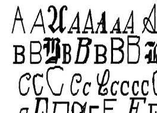

# Letter Recognition

The objective is to identify each of a large number of black-and-white rectangular pixel displays as one of the 26 capital letters in the English alphabet. 

The character images were based on 20 different fonts and each letter within these 20 fonts was randomly distorted to produce a file of 20,000 unique stimuli. 

Each stimulus was converted into 16 primitive numerical attributes (statistical moments and edge counts) which were then scaled to fit into a range of integer values from 0 through 15. 

We typically train on the first 16000 items and then use the resulting model to predict the letter category for the remaining 4000. 

### __Attribute Information:__

1.	letter	capital letter	(26 values from A to Z) 
2.	x-box	horizontal position of box	(integer) 
3.	y-box	vertical position of box	(integer) 
4.	width	width of box	(integer) 
5.	high    height of box	(integer) 
6.	onpix	total # on pixels	(integer) 
7.	x-bar	mean x of on pixels in box	(integer) 
8.	y-bar	mean y of on pixels in box	(integer) 
9.	x2bar	mean x variance	(integer) 
10.	y2bar	mean y variance	(integer) 
11.	xybar	mean x y correlation	(integer) 
12.	x2ybr	mean of x * x * y	(integer) 
13.	xy2br	mean of x * y * y	(integer) 
14.	x-ege	mean edge count left to right	(integer) 
15.	xegvy	correlation of x-ege with y	(integer) 
16.	y-ege	mean edge count bottom to top	(integer) 
17.	yegvx	correlation of y-ege with x	(integer)

## EDA

EDA is the practice of describing the data by means of statistical and visualization techniques to bring important aspects of that data into focus for further analysis. This involves looking at your data set from many angles, describing it, and summarizing it without making any assumptions about its contents. 

This is a significant step to take before diving we dive into implementing machine learning models.

x-box values is highest for W and then for M for obvious reasons of them being wider letters. This value is lowest for I.

Width and x- box are quite similar in patterns for all the letters.

Across all fonts letter M has the maximum no of pixels.

x-box and width, y-box and high are highly correlated.

There are some more visualizations , which you can view in my jupyter notebook.

# Models and Evaluations

Since this is a classification problem of classifying fonts into one of the 26 letters, I have tried out some of the algorithms that perform well for classification scenarios.

Accuracy score could be one good metric for testing the models.

Post going through  implementing various models, I have seen that the accuracy of the models is better when support Vector Machines is implemented.

__Support Vector Classifer__ is giving the highest accuracy compared to other models with  score of "__96 %__"  hence we choose the algorithm for letter prediction.

__Hyperparameters used__
C=1000

gamma=0.01

kernel= rbf

